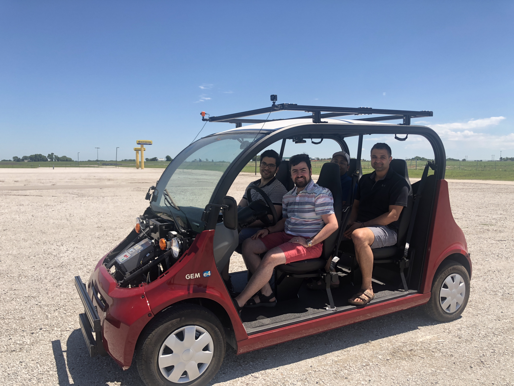

# Iowa State University self driving car

   
  
    

 <!-- 

  

 -->

---
##### Checkout to _saeed_dev_ branch for the implementations. 
---
# TODO:

- [ ] Fix the battery issue of the car
- [x]   Setting up ROS and Pacmod related packages on the new Ubuntu laptop
- [ ]    Testing the drive by wire system of the car
  - [ ]    Driving the car with Joystick
  - [ ]    Testing the joystick commands and ensure their correctness (Acceleration/ Deceleration, steering)
  - [ ]    Checking the CAN messages and confirming their correctness

- [ ]   Setting up gazebo simulation
  - [x]   Setting up a plane world gazebo simulation
  - [x]   Spawning the car representative (simple ackerman steering model or the actual GEM polaris model)
  - [x]   Testing the simulator by publishing the throttle and steering commands
  - [x]   Adding GPS plugin in the Gazebo
  - [x]   Adding IMU plugin in the Gazebo
  - [x]   Sensor fusion for localization
  - [x]   Adding the camera model
  - [x]   Adding the Lidar model
  - [ ]   Correct the vehicle model